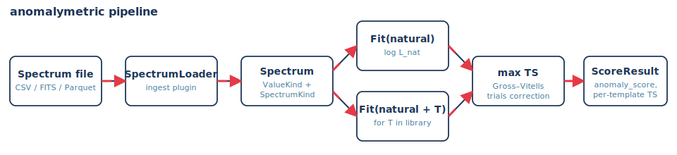

# anomalymetric

> Rank detected emissions by how unusual their spectra are versus a natural-source mixture.

A Python framework inspired by the [Loeb–Turner test](https://avi-loeb.medium.com/searching-for-artificial-light-sources-in-the-solar-system-based-on-the-loeb-turner-test-452722c2ac46)
for artificial light sources. Solar reflection + thermal self-emission + known
astrophysical power-laws form the "natural mixture"; a curated library of
laser lines, axion lines, hard-cutoff power-laws, and GZK-violating tails
forms the "exotic" alternative. The score is a **profile-likelihood ratio**
with a Gross–Vitells / Bonferroni look-elsewhere correction.

Photons (radio → gamma) and cosmic rays (eV → ZeV) live on a unified
`log10(E/eV)` axis but use channel-specific Poisson likelihoods under the
hood.

<p align="center">
  
</p>

## What the score does

```mermaid
flowchart TD
  A[Spectrum file<br/>CSV / FITS / Parquet] -->|SpectrumLoader| B[Spectrum<br/>ValueKind + SpectrumKind]
  B --> E[Fit&#40;natural&#41;<br/>log L_nat]
  E --> F[Loop over exotic library<br/>Fit&#40;natural + template&#41;]
  F --> G[max TS = -2 ln L_nat/L_alt]
  G --> H[Gross&#8211;Vitells trials correction]
  H --> I[ScoreResult<br/>anomaly_score]
```




The library covers laboratory laser lines, axion-decay masses, hard spectral
cutoffs, and GZK-violating cosmic-ray tails. When a template matches, the
test statistic separates immediately from the background:

<p align="center">
  
</p>

## Install

```
python3 -m venv .venv
.venv/bin/pip install -e ".[dev]"
```

Optional extras: `[archives]` (astroquery), `[bayes]` (emcee + dynesty),
`[cr]` (CRPropa3), `[naima]` (non-thermal SED models), `[docs]` (mkdocs +
figure-regeneration deps).

## Quickstart

```
# generate two synthetic spectra (one clean, one with an injected 532 nm line)
.venv/bin/anomalymetric generate synthetic --kind blackbody -o /tmp/bb.parquet --seed 0
.venv/bin/anomalymetric generate synthetic --kind exotic_line --line-ev 2.331 --line-amplitude 5000 -o /tmp/anom.parquet --seed 1

# rank
.venv/bin/anomalymetric score /tmp/bb.parquet /tmp/anom.parquet -o /tmp/rank.csv
```

The anomalous file ranks first with a TS in the tens of thousands; the clean
file barely registers.

Python API:

```python
from anomalymetric.ingest.synthetic import synthetic_natural, synthetic_with_exotic
from anomalymetric.models.powerlaw import PowerLaw
from anomalymetric.models.thermal import BlackBody
from anomalymetric.score.loeb_turner import loeb_turner_score

base = synthetic_natural(T_K=300., exposure_cm2_s=1e6, seed=0)
anom = synthetic_with_exotic(base, line_E_eV=2.33, line_amplitude=5e3, seed=1)
natural = [BlackBody(T_K=300.), PowerLaw(amplitude=1e-3, index=2., reference_eV=1.)]

print(loeb_turner_score(anom, natural).anomaly_score)
```

## Two ways in

| For users (astrophysicists) | For contributors |
| --- | --- |
| [Installation](docs/for-users/installation.md) | [Architecture](docs/for-contributors/architecture.md) |
| [Quickstart](docs/for-users/quickstart.md) | [Design decisions](docs/for-contributors/design-decisions.md) |
| [Concepts](docs/for-users/concepts.md) | [Extending models](docs/for-contributors/extending-models.md) |
| [Physics](docs/for-users/physics.md) | [Extending loaders](docs/for-contributors/extending-loaders.md) |
| [Scoring](docs/for-users/scoring.md) | [Testing](docs/for-contributors/testing.md) |
| [Cosmic rays](docs/for-users/cosmic-rays.md) | |
| [CLI reference](docs/for-users/cli.md) | |

Walk-throughs as Jupyter notebooks: [`notebooks/`](notebooks/).

## Tests

```
.venv/bin/pytest
```

31 tests; runs in about a minute. See
[`docs/for-contributors/testing.md`](docs/for-contributors/testing.md) for
the layout.

## Documentation site

The `docs/` tree is also publishable as a [mkdocs-material](https://squidfunk.github.io/mkdocs-material/)
site:

```
.venv/bin/pip install -e ".[docs]"
.venv/bin/mkdocs serve --config-file docs/mkdocs.yml      # http://localhost:8000
.venv/bin/mkdocs build --strict --config-file docs/mkdocs.yml
```

A `.github/workflows/docs.yml` workflow ships in the repo to deploy on
push to `main`; enable GitHub Pages on the `gh-pages` branch to publish.

## How it fits together

| Module        | Purpose |
| ---           | --- |
| `spectrum`    | `Spectrum` dataclass with explicit `ValueKind` / `SpectrumKind` |
| `units`       | log10(E/eV) axis helpers; Hz, nm, eV conversions |
| `forward`     | Identity / Gaussian-resolution response, exposure, K-correction |
| `models`      | Blackbody, solar reflection, power-laws, lines, mixtures, MLE `Fit` |
| `models.exotic` | Matched-filter library: laser, axion, hard-cutoff, GZK-violating |
| `score`       | Profile-likelihood ratio + Gross–Vitells trials + ranking |
| `cosmicray`   | CR factories, PDG all-particle reference, triple-broken-PL fit, CR PLR |
| `ingest`      | Synthetic generator, tabular loaders, archive stubs, plugin registry |
| `pipeline` / `cli` | Orchestration + Typer-based command line |

The load-bearing decisions are recorded in
[CLAUDE.md](./CLAUDE.md) and
[docs/for-contributors/design-decisions.md](docs/for-contributors/design-decisions.md).
