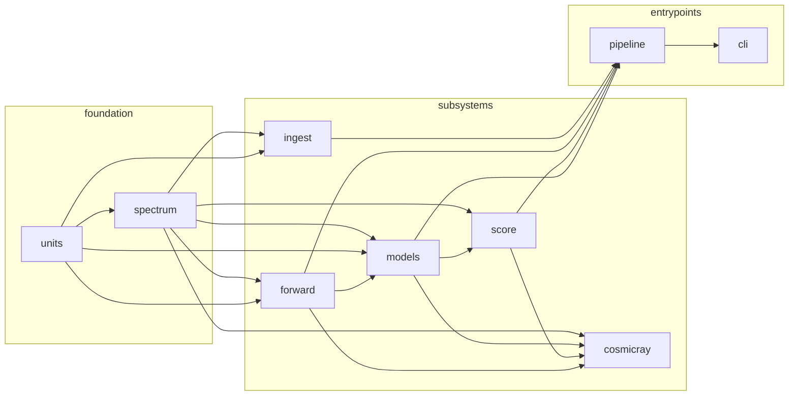
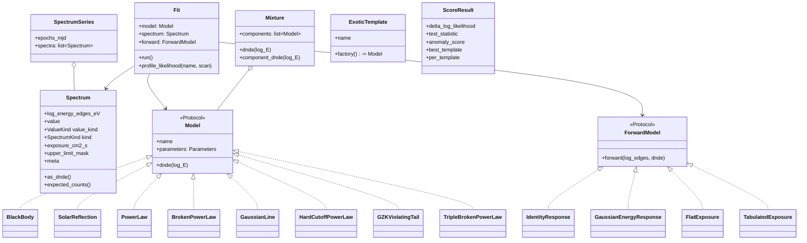

# Architecture

The package follows a gammapy-inspired `Dataset / Model / Fit` shape so the
implementation can later be retargeted onto gammapy without breaking user code.

## Module dependency graph



`spectrum` and `units` are the foundation; nothing imports above them. `cli`
and `pipeline` are the only entry points users should call.

## Class structure



`Model` and `ForwardModel` are `typing.Protocol`s — implement them by writing
a class with the right attributes; no inheritance required. `Mixture`,
`ExoticTemplate`, `Fit`, and `ScoreResult` are concrete dataclasses.

## End-to-end pipeline

```mermaid
flowchart TD
  A[Spectrum file<br/>CSV / FITS / Parquet] -->|SpectrumLoader| B[Spectrum<br/>ValueKind + SpectrumKind]
  B --> C{kind?}
  C -->|photon| D1[IdentityResponse /<br/>GaussianEnergyResponse]
  C -->|cr_*| D2[FlatExposure /<br/>TabulatedExposure]
  C -->|neutrino| D3[Effective area]
  D1 --> E[Fit&#40;natural&#41;<br/>log L_nat]
  D2 --> E
  D3 --> E
  E --> F[Loop over exotic library<br/>Fit&#40;natural + template&#41;]
  F --> G[max TS = -2 ln L_nat/L_alt]
  G --> H[Gross&#8211;Vitells trials correction]
  H --> I[ScoreResult<br/>anomaly_score]
  I --> J[Ranking CSV / Parquet]
```



## Package layout

```
src/anomalymetric/
├── __init__.py              # top-level re-exports
├── spectrum.py              # Spectrum + SpectrumSeries
├── units.py                 # log10(E/eV) helpers; Hz/nm/eV conversions
├── forward/                 # response, exposure, distance/K-correction
├── models/                  # physical Models + exotic library + Fit
├── score/                   # loeb_turner, trials, ranking, bayes (stub)
├── cosmicray/               # CR factories + reference + knee/ankle + CR scoring
├── ingest/                  # loaders + entry-point plugin registry
├── pipeline.py              # orchestration
└── cli.py                   # Typer CLI
```

Things deliberately **not** in this tree:

- A separate `fit/` package. Fitting is a method on a model; merging into
  `models/inference.py` avoids circular imports.
- A `dataset.py` aggregator. The `(Spectrum, Model, ForwardModel, Fit)` tuple
  is enough — adding a `Dataset` wrapper before we have real instrument
  responses would be premature.
- Configuration files (YAML / TOML). Construct objects in Python.

For *why* the architecture is shaped this way, read
[`design-decisions.md`](design-decisions.md).
