# Design decisions

These six choices are *load-bearing* — changing any of them would ripple
through the rest of the package. Each was deliberate and is recorded here so
contributors can judge edge cases without re-deriving the trade-offs.

## 1. `Spectrum.value_kind` is explicit, not inferred

**Decision.** Every `Spectrum` carries a `ValueKind` enum that names the unit
convention of its `value` array (`dNdE`, `EdNdE`, `E2dNdE`, `nuFnu`,
`photon_rate_per_bin`, `counts_per_bin`).

**Why.** "Differential flux" means four incompatible things across radio,
X/gamma, and cosmic-ray astronomy. Inferring from the magnitude — or worse,
guessing from a column name — silently corrupts the likelihood. The cost is
one enum field; the benefit is that every downstream consumer reads a
well-defined quantity.

**What breaks if we change this.** Likelihoods become unit-fragile. The whole
"unified pipeline" claim falls apart.

## 2. Likelihood dispatches on `SpectrumKind`

**Decision.** A single `likelihood(spectrum, model, forward=None)` entry point
picks the forward model from `spectrum.kind`: photon → identity or Gaussian
response, cosmic-ray → flat or tabulated exposure, neutrino → effective area.

```mermaid
flowchart LR
  S[Spectrum]
  S --> K{kind}
  K -->|photon| P1[IdentityResponse]
  K -->|photon w/ resolution| P2[GaussianEnergyResponse]
  K -->|cr_proton<br/>cr_nucleus<br/>cr_allparticle| C1[FlatExposure]
  K -->|cr_* w/ A_eff&#40;E&#41;| C2[TabulatedExposure]
  K -->|neutrino| N1[Effective area<br/>&#40;forward stub&#41;]
  P1 --> L[Poisson log L<br/>on expected counts/bin]
  P2 --> L
  C1 --> L
  C2 --> L
  N1 --> L
```

**Why.** Forcing photons and cosmic rays through a single likelihood requires
normalization hacks (per-steradian vs per-photon-bin, energy flux vs number
flux). Dispatching on `kind` keeps the math honest and confines each channel's
quirks to its own forward model.

**What breaks if we change this.** Pretending all spectra are photons makes
CR scoring physically wrong (off by `solid_angle × livetime`). Pretending all
are CRs adds a meaningless steradian factor to photon counts.

## 3. Score is a profile-likelihood ratio with a trials correction

**Decision.** `loeb_turner_score` profiles nuisance parameters under both
hypotheses, returns `TS = -2 ln(L_nat / L_alt) ≥ 0`, and applies a
Gross–Vitells / Bonferroni correction for the library size. Two outputs are
exposed separately:

- `delta_log_likelihood` (raw)
- `anomaly_score = -log10(p_global)` (calibrated)

**Why.** Plain ΔlogL with a flexible alternative is statistically degenerate
(Wilks' theorem fails at the boundary). PLR is the convention every modern
γ-ray fitting stack uses; the trials correction prevents the look-elsewhere
effect from inflating significance.

**What breaks if we change this.** Reports with un-corrected ΔlogL look much
more significant than they are. Reviewers reject any source-ranking analysis
that doesn't show its trials factor.

## 4. The exotic component is a *fixed* template library

**Decision.** `models/exotic.py` ships a curated library of templates with
locked shape parameters; only amplitudes are free. The score is `max_T TS_T`
over the library with a `len(library)` Bonferroni penalty (or
`n_trials`-scaled Gross–Vitells for continuous scans).

**Why.** A free-floating exotic line will park itself on the biggest Poisson
fluctuation and give an unfalsifiable likelihood ratio. Pinning energies to
laboratory wavelengths or known axion masses makes the test physical *and*
produces a well-defined trials factor.

**What breaks if we change this.** Statistical degeneracy returns. Users
report "5σ" anomalies that disappear under repeated sampling.

## 5. `fit/` is merged into `models/inference.py`

**Decision.** No standalone fitting subpackage. The `Fit` class lives next to
the `Model` protocol it operates on.

**Why.** Fitting is a method on a model, not a separate domain. Splitting them
forces a circular-import dance: `fit.py` needs `Model`; `Model` needs to know
what parameters are free; `fit.py` consumes that and re-exports.

**What breaks if we change this.** A `ModelRegistry` and `FitterRegistry`
that nobody uses; circular imports that bite when the optional `naima`
adapter lands.

## 6. The API mirrors gammapy's `Dataset / Model / Fit` vocabulary

**Decision.** We use gammapy's class names and method signatures
(`Dataset`-shaped tuples, `Model.parameters: Parameters`, `Fit.run()`,
`Fit.profile_likelihood()`) without depending on gammapy itself.

**Why.** gammapy is the canonical PLR-based fitting stack for γ-ray astronomy.
Adopting its vocabulary means users coming from gammapy read this code
fluently; if v2 wants to use gammapy directly, the call sites don't move.

**What breaks if we change this.** A future gammapy migration becomes a
rewrite. New users coming from gammapy have to learn yet another name for the
same idea.

## Where these decisions live in the code

| Decision | Files |
| --- | --- |
| Explicit `value_kind` | `src/anomalymetric/spectrum.py` |
| Channel dispatch | `src/anomalymetric/models/inference.py` (`likelihood`, `_default_forward_for`) |
| Profile-likelihood + trials | `src/anomalymetric/score/loeb_turner.py`, `src/anomalymetric/score/trials.py` |
| Fixed exotic library | `src/anomalymetric/models/exotic.py` |
| Inference inside `models/` | `src/anomalymetric/models/inference.py` |
| gammapy-mirrored API | `src/anomalymetric/models/base.py`, `src/anomalymetric/forward/base.py`, `src/anomalymetric/models/inference.py` |
