# Concepts

Three ideas drive the API. Get these and the rest of the docs read fluently.

## 1. The unified log-energy axis

Internally, every spectrum lives on the same coordinate: `log10(E / eV)`.
Photons span roughly −7 (a meter-wave radio photon) to +15 (a UHE gamma);
cosmic rays extend to +21 (a ZeV particle). The axis is a *plotting and
ranking* convenience — likelihoods still dispatch per channel (see below).


## 2. The flux unit is the trap

"Differential flux" means at least four incompatible things across radio,
X/gamma, and cosmic-ray astronomy:

- Radio / IR / visible: `νF_ν` (energy flux per log-energy bin, erg s⁻¹ cm⁻²).
- X/γ-ray: `dN/dE` (number flux per linear energy, photons cm⁻² s⁻¹ keV⁻¹).
- Cosmic rays: `J(E)` (number flux per solid angle per linear energy,
  particles m⁻² s⁻¹ sr⁻¹ eV⁻¹), often plotted as `E²J` or `E³J`.
- Observed counts in a binned detector: just *counts per bin*.

If we accepted a single "flux" array and guessed, we would silently corrupt
the likelihood. So `Spectrum` carries an explicit `value_kind` enum and an
explicit `kind` enum:

```python
from anomalymetric.spectrum import Spectrum, SpectrumKind, ValueKind

spec = Spectrum(
    log_energy_edges_eV=...,
    value=...,
    value_kind=ValueKind.E2DNDE,        # one of dNdE / EdNdE / E2dNdE / nuFnu / counts_per_bin
    kind=SpectrumKind.PHOTON,           # photon / cr_proton / cr_nucleus / cr_allparticle / neutrino
    exposure_cm2_s=...,                  # required for counts_per_bin
)
```

The `as_dnde()` and `expected_counts(...)` methods canonicalize whichever
representation you passed in, so downstream code (`models/inference.py`,
`score/loeb_turner.py`) reads a single Poisson-natural per-bin-counts array.

## 3. Likelihood dispatches on `SpectrumKind`

```mermaid
flowchart LR
  S[Spectrum]
  S --> K{kind}
  K -->|photon| P1[IdentityResponse]
  K -->|photon w/ resolution| P2[GaussianEnergyResponse]
  K -->|cr_proton<br/>cr_nucleus<br/>cr_allparticle| C1[FlatExposure]
  K -->|cr_* w/ A_eff&#40;E&#41;| C2[TabulatedExposure]
  K -->|neutrino| N1[Effective area<br/>&#40;forward stub&#41;]
  P1 --> L[Poisson log L<br/>on expected counts/bin]
  P2 --> L
  C1 --> L
  C2 --> L
  N1 --> L
```



There is *one* `likelihood(spectrum, model, forward=None)` entry point in
`anomalymetric.models.inference`. It picks the default forward model based on
`spectrum.kind` (`IdentityResponse` for photons, `FlatExposure` for cosmic
rays). Custom forward models — real instrument response files, tabulated
exposure curves — are passed in explicitly.

The "unified energy axis" is a *visual* convention; the *math* is
channel-specific. Treating cosmic rays and photons through a single likelihood
function would force ugly normalization hacks. Keeping the `kind` switch
explicit is what makes the architecture honest.

## Where to go next

- [Physics](physics.md) for the actual model library.
- [Scoring](scoring.md) for what the score means and how trials correction
  enters.
- [Design decisions](../for-contributors/design-decisions.md) for *why* the API
  is shaped this way.
