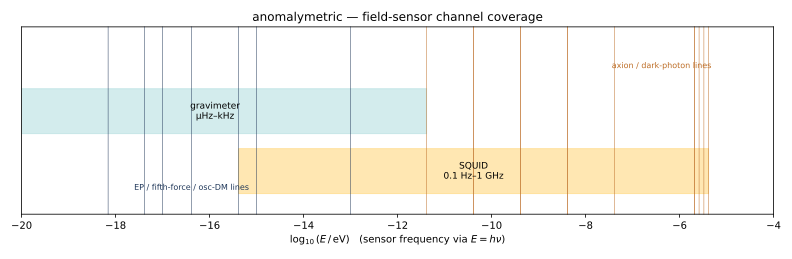

# Magnetometric (SQUID)

The magnetometric module reuses the same `Spectrum`, `Model`, `Fit`, and PLR
machinery as the photon and cosmic-ray paths — but the observable is a
continuous **power spectral density** S(f) of the measured flux noise, with
**Gaussian** statistics rather than Poisson counts. The frequency axis maps onto
the package's shared `log10(E/eV)` axis via `E = hν`, so a SQUID haloscope and a
photon detector hunt the *same* axion line at `f = m_a c²/h` on one axis.



## The noise floor as the natural baseline

The "natural mixture" is the instrument flux-noise floor: a white level with a
1/f corner. `magnetometric.spectrum.squid_reference_psd` returns the fixed shape;
`magnetometric.score.SQUIDNoiseFloor` wraps it with a single free amplitude (the
analog of the cosmic-ray all-particle reference).

```python
from anomalymetric.magnetometric.spectrum import squid_band_grid, squid_reference_psd
import numpy as np
edges = squid_band_grid(2.0, 9.0, bins_per_decade=20)   # 100 Hz … 1 GHz
centers = 0.5 * (edges[:-1] + edges[1:])
floor = squid_reference_psd(np.log10(centers))
```

`magnetometric.models` provides `DCSQUIDNoise` (white + 1/f) and `RFSQUIDNoise`
(adds a high-frequency back-action term) — the rf/dc distinction is a *noise
shape*, not a separate channel.

## Scoring for haloscope signals

```python
from anomalymetric.magnetometric.score import squid_score
result = squid_score(spectrum)            # spectrum.kind == MAGNETOMETRIC
print(result.anomaly_score, result.best_template)
```

The exotic library is a grid of narrow axion / dark-photon lines across canned
haloscope bands (ABRACADABRA, ADMX, SHAFT) plus a couple of broadband bumps for
unmodeled excess. An axion of mass `m_a` sits at `E_center = m_a` (in eV) on the
shared axis, because the bin energy *is* `hν`:

```python
from anomalymetric.magnetometric.haloscope import axion_mass_to_freq_hz, ADMX
axion_mass_to_freq_hz(4e-6)               # ≈ 9.7e8 Hz (ADMX band)
ADMX.mass_grid_eV(4)                       # candidate masses across the band
```

## Generating synthetic data

```
anomalymetric generate squid --kind noise_floor -o bg.parquet --seed 0
anomalymetric generate squid --kind axion_line --mass-ev 4e-6 --line-amplitude 8 -o sig.parquet --seed 1
anomalymetric score bg.parquet sig.parquet -o rank.csv
```

`--line-amplitude` is the line's peak height as a multiple of the local noise
floor. See `notebooks/05_magnetometric_haloscope.ipynb` for a worked example.

## Out of scope for v1

- Real DAQ / cavity backends (a `[squid]` extra stub raises `NotImplementedError`).
- Stochastic-signal lineshapes from the full dark-matter velocity distribution.
- Multi-channel / vector-magnetometer correlation analysis.
