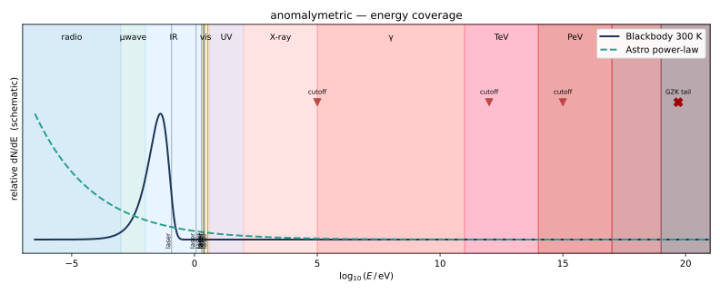
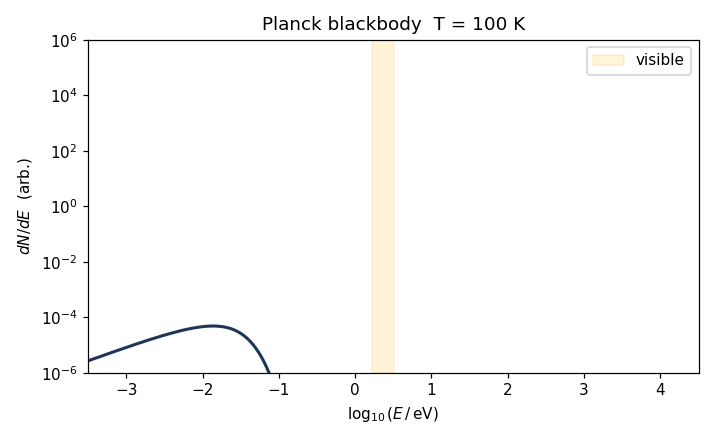
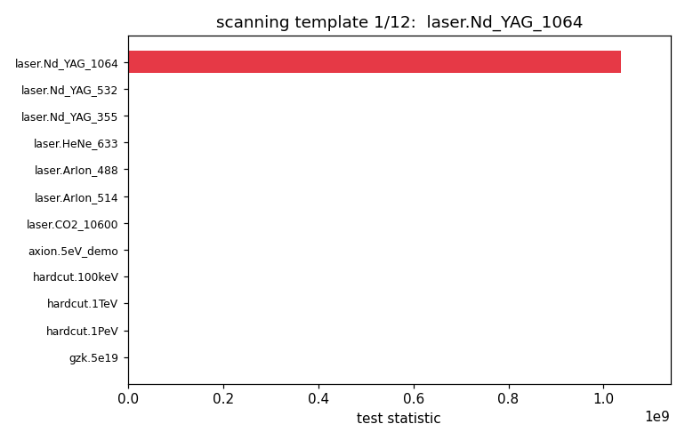

# Physics

The score asks: *given this observed spectrum, how much better does an "exotic"
model fit than a "natural" mixture?* Both sides are built from the components
below.

## The natural mixture

Three component families currently ship; you can plug in more by implementing
the [`Model` protocol](../for-contributors/extending-models.md).

### Planck blackbody

A greybody — Planck shape with a single free `amplitude` carrying the geometric
prefactor:

$$\frac{dN}{dE} \propto A \cdot \frac{E^2}{\exp(E/kT) - 1}$$

Parameters: `T_K` and `amplitude`. Defined in
[`models/thermal.py`](https://github.com/your-org/anomalymetric/blob/main/src/anomalymetric/models/thermal.py).

The shape evolves with temperature like this — peak shifts to higher energy as
T grows (Wien's displacement law):

### Solar reflection

A 5778 K Planck shape (the Sun's effective temperature) scaled by `albedo` ×
`phase_factor`. Sun temperature and amplitude are frozen; the user fits albedo
and phase. The Kurucz solar SED is a known follow-up — the current 5778 K
greybody is a placeholder.

### Astrophysical power-laws

Generic `PowerLaw` (`dN/dE = A·(E/E₀)^−α`) and `BrokenPowerLaw` for fitting
SEDs with one spectral break (synchrotron cooling break, IC cutoff). For
non-thermal models with real physics — synchrotron + inverse Compton + π⁰
decay — install the `[naima]` extra and substitute a naima-backed model with
the same `Model` protocol.

### Mixture

`Mixture([component, component, ...])` returns a `Model` whose `dnde` is the
sum and whose `parameters` are the concatenation of the components'
parameters (prefixed with the component name to avoid collisions).

## The exotic library

A *fixed* library of templates — not a free exotic mixture, which would
always win the likelihood ratio. Each template is a `Model` with locked shape
parameters; only the amplitude is free.

| Template family | Examples | Free parameter | Use case |
| --- | --- | --- | --- |
| Laser lines | Nd:YAG 1064/532/355 nm, HeNe 633, ArIon 488/514, CO₂ 10600 | amplitude | Loeb–Turner artificial-light test |
| Axion-decay lines | mass-pinned monochromatic lines | amplitude | dark-matter line searches |
| Hard-cutoff power-laws | 100 keV, 1 TeV, 1 PeV | amplitude | exotic injection above cooling break |
| GZK-violating tail | smooth high-pass above 5×10¹⁹ eV | amplitude | cosmic-ray exotic signature |

The full library is in
[`models/exotic.py`](https://github.com/your-org/anomalymetric/blob/main/src/anomalymetric/models/exotic.py)
and is exposed by `anomalymetric.models.exotic.default_library()`.

When a single template wins the likelihood, you see it clearly:

## Why fix the templates?

A free-energy, free-width line model is statistically degenerate against any
spectrum: with enough freedom, the line will park itself on the largest
Poisson fluctuation in the data and produce an unfalsifiable likelihood
ratio. Pinning the energy to laboratory laser wavelengths or to known axion
masses gives the test physical meaning and a well-defined trials factor (the
size of the library, plus an explicit penalty for any continuous scan).

For more on the statistics see [Scoring](scoring.md).
