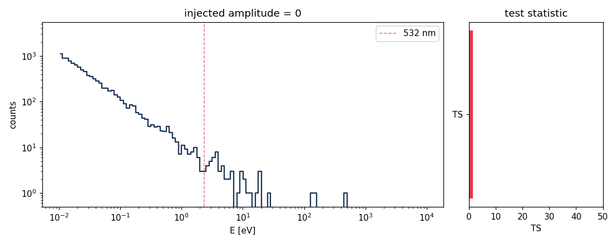

# Quickstart

A minute-long tour: generate a clean blackbody spectrum, inject a laser line,
and rank the two against each other.

## CLI

```
# clean background
.venv/bin/anomalymetric generate synthetic \
    --kind blackbody -o /tmp/bb.parquet --seed 0

# same background plus an injected 532 nm line
.venv/bin/anomalymetric generate synthetic \
    --kind exotic_line --line-ev 2.331 --line-amplitude 5000 \
    -o /tmp/anom.parquet --seed 1

# rank
.venv/bin/anomalymetric score /tmp/bb.parquet /tmp/anom.parquet -o /tmp/rank.csv
```

Expected output (template names will match exactly):

```
/tmp/anom.parquet                         score=300.000  TS=66072.15  best=laser.ArIon_514
/tmp/bb.parquet                           score=0.437    TS=3.18      best=laser.ArIon_488
```

The anomalous file ranks first; the clean file barely registers, with its
"best" template just the closest no-injection noise excursion.

## What just happened

```mermaid
flowchart TD
  A[Spectrum file<br/>CSV / FITS / Parquet] -->|SpectrumLoader| B[Spectrum<br/>ValueKind + SpectrumKind]
  B --> C{kind?}
  C -->|photon| D1[IdentityResponse /<br/>GaussianEnergyResponse]
  C -->|cr_*| D2[FlatExposure /<br/>TabulatedExposure]
  C -->|neutrino| D3[Effective area]
  D1 --> E[Fit&#40;natural&#41;<br/>log L_nat]
  D2 --> E
  D3 --> E
  E --> F[Loop over exotic library<br/>Fit&#40;natural + template&#41;]
  F --> G[max TS = -2 ln L_nat/L_alt]
  G --> H[Gross&#8211;Vitells trials correction]
  H --> I[ScoreResult<br/>anomaly_score]
  I --> J[Ranking CSV / Parquet]
```



For an animated overview of the same flow see the
[pipeline-overview SVG](../img/pipeline-overview.svg).

## Python API

```python
from anomalymetric.ingest.synthetic import synthetic_natural, synthetic_with_exotic
from anomalymetric.models.powerlaw import PowerLaw
from anomalymetric.models.thermal import BlackBody
from anomalymetric.score.loeb_turner import loeb_turner_score

base = synthetic_natural(T_K=300., exposure_cm2_s=1e6, seed=0)
anom = synthetic_with_exotic(base, line_E_eV=2.33, line_amplitude=5e3, seed=1)
natural = [BlackBody(T_K=300.), PowerLaw(amplitude=1e-3, index=2., reference_eV=1.)]

result = loeb_turner_score(anom, natural)
print(result.test_statistic, result.anomaly_score, result.best_template)
```

What this returns is detailed in [Scoring](scoring.md). The line-injection
animation that drives the score is here:



## Next steps

- [Concepts](concepts.md) — why `Spectrum` is stricter than "just an array".
- [Physics](physics.md) — the natural mixture and the exotic library.
- [CLI reference](cli.md) — every `anomalymetric` subcommand.
