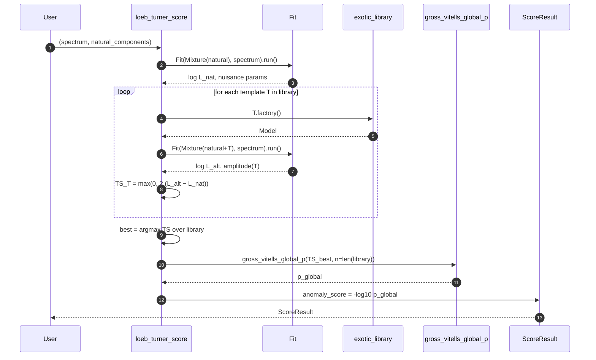

# Scoring

## The test statistic

For each exotic template `T` in the library, we fit two hypotheses to the same
spectrum:

- `M_nat`: the natural mixture (blackbody + reflection + power-laws + lines).
  Nuisance parameters are *profiled out* — maximized over.
- `M_alt = M_nat + T`: same mixture plus the template. `T`'s amplitude is free;
  everything else (its center energy, shape) is locked.

The per-template test statistic is

$$\mathrm{TS}_T = -2 \left[\, \ln L(\mathrm{data}\mid M_\mathrm{nat}) - \ln L(\mathrm{data}\mid M_\mathrm{alt})\,\right] \;\ge\; 0$$

The score for the source is `max_T TS_T` — the strongest template wins.



## Why a profile likelihood ratio (PLR)?

A naive `ΔlogL` is degenerate when the alternative *contains* the null on a
parameter boundary (the exotic amplitude = 0 case). Wilks' theorem then gives
the PLR a half-χ²₁ asymptotic distribution under the null:

$$p_\mathrm{local} \approx \tfrac{1}{2}\, \mathrm{P}\!\left(\chi^2_1 > \mathrm{TS}\right)$$

This is the convention every modern γ-ray astronomy stack uses (Fermi-LAT
`gtlike`, gammapy, sherpa). See Mattox+ 1996 and Rolke+ 2005.

## Look-elsewhere — the trials correction

With *N* templates in the library, the chance of *any* of them passing a given
TS threshold under the null grows ~N×. We apply the Gross–Vitells (2010)
correction; for a *discrete* template library the formula reduces to a
Bonferroni-style:

$$p_\mathrm{global} = 1 - (1 - p_\mathrm{local})^N$$

For a continuous scan over a template parameter (e.g., sweeping an axion line
energy across a band), the proper Gross–Vitells formula uses an empirically
calibrated upcrossing count `⟨N(TS_ref)⟩`. The current implementation supplies
the conservative Bonferroni approximation and exposes the parameter as
`n_trials` so users can plug in a calibrated value.

```python
from anomalymetric.score.trials import gross_vitells_global_p

p = gross_vitells_global_p(ts=25.0, n_trials=12)  # 5σ local → ~3.7σ global at N=12
```

## What `ScoreResult` carries

```python
@dataclass
class ScoreResult:
    delta_log_likelihood: float       # raw ΔlogL of the best template
    test_statistic: float             # TS_best
    anomaly_score: float              # -log10(p_global)
    best_template: str                # e.g. "laser.Nd_YAG_532"
    per_template: list[TemplateScore] # full per-template breakdown
    natural_parameters: dict          # MLE values for the natural mixture
    notes: str
```

`anomaly_score` is the *publishable* quantity. The reason we expose both
`delta_log_likelihood` and `test_statistic` is so reviewers can verify the
trials correction is being applied honestly.

## Interpretation rules of thumb

| anomaly_score | rough global significance | What it means |
| --- | --- | --- |
| < 1.0 | < 1σ | consistent with the natural mixture |
| 1.0 – 2.0 | 1–2σ | interesting; check the per-template breakdown |
| 2.0 – 5.0 | 2–5σ | follow up — check the spectrum, instrument systematics |
| > 5.0 | > 5σ | discovery-class; verify with independent data before publishing |

These are *one-sided* thresholds (the boundary 0 case means we get a factor of
two in the local p compared to a two-sided chi-square test).

## Watching the score develop

Injecting a 532 nm line of growing amplitude into a clean background produces
exactly the behavior the math predicts — TS rises with the signal-to-noise:


## Caveats

- The natural mixture must include all the *known* astrophysical components for
  the source you are scoring. A missing power-law tail will be flagged as an
  anomaly. The default mixture (blackbody + power-law) is appropriate for
  unresolved solar-system objects; pulsars and AGN need different priors.
- The Bonferroni trials factor is conservative for a discrete library and
  *very* conservative when the library templates overlap in energy. A
  calibrated `⟨N⟩` from background simulations is the right fix for any
  publication-quality result.
- Upper-limit bins use a one-sided Rolke-style penalty; full Feldman–Cousins
  censored-data handling is a known v2 follow-up.
