# anomalymetric

A Python framework for ranking detected emissions by how unusual their spectra
are versus a natural-source mixture — solar reflection, thermal self-emission,
and known astrophysical power-laws. Inspired by the
[Loeb–Turner test](https://avi-loeb.medium.com/searching-for-artificial-light-sources-in-the-solar-system-based-on-the-loeb-turner-test-452722c2ac46)
for artificial light sources in the solar system.

  

Photons (radio → gamma) and cosmic rays (eV → ZeV) live on a unified
`log10(E/eV)` axis. The score is a **profile-likelihood ratio** against a
curated library of exotic templates (laser lines, axion lines, hard-cutoff
power-laws, GZK-violating tails), with a Gross–Vitells / Bonferroni
look-elsewhere correction.

```mermaid
flowchart TD
  A[Spectrum file<br/>CSV / FITS / Parquet] -->|SpectrumLoader| B[Spectrum<br/>ValueKind + SpectrumKind]
  B --> E[Fit&#40;natural&#41;<br/>log L_nat]
  E --> F[Loop over exotic library<br/>Fit&#40;natural + template&#41;]
  F --> G[max TS = -2 ln L_nat/L_alt]
  G --> H[Gross&#8211;Vitells trials correction]
  H --> I[ScoreResult<br/>anomaly_score]
```

## Two ways in

- **For users** — astrophysicists treating it as a library. Start with
  [Installation](for-users/installation.md) → [Quickstart](for-users/quickstart.md)
  → [Concepts](for-users/concepts.md) → [Scoring](for-users/scoring.md).
- **For contributors** — extending or hacking the code. Start with
  [Architecture](for-contributors/architecture.md) →
  [Design decisions](for-contributors/design-decisions.md) →
  [Extending models](for-contributors/extending-models.md).

The project's load-bearing design decisions are recorded in
[`design-decisions`](for-contributors/design-decisions.md) and
[`CLAUDE.md`](https://github.com/your-org/anomalymetric/blob/main/CLAUDE.md) at
the repo root.
